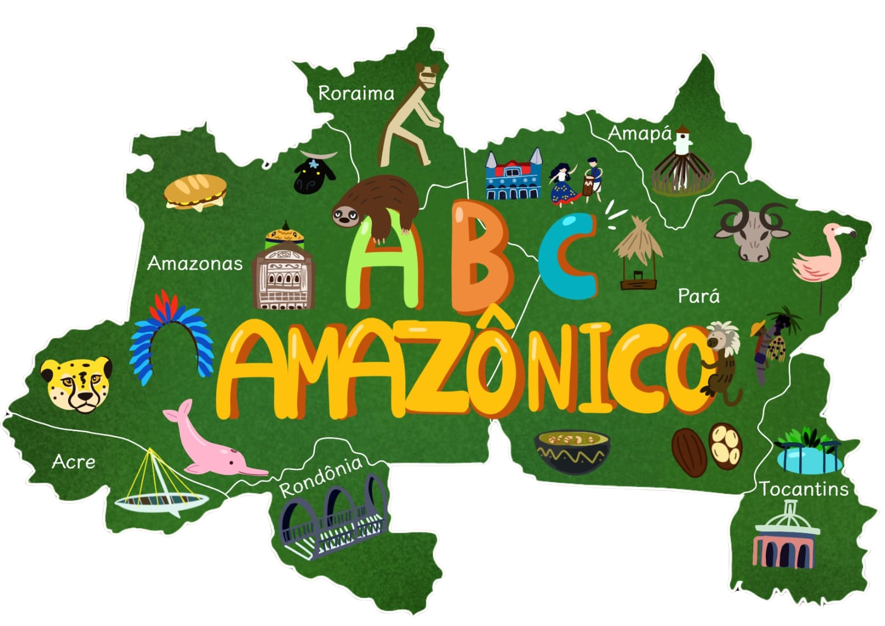

  

# ABC Amazônico - Alexa Skill

**ABC Amazônico** é uma jornada interativa que celebra a cultura, fauna e flora únicas da região Norte do Brasil. Com esta skill, você vai se divertir enquanto descobre palavras, expressões e curiosidades ligadas ao universo amazônico.

Ao abrir a skill, você será convidado a explorar as letras do alfabeto. Cada letra representa algo especial da Amazônia, seja uma fruta típica, um animal exótico ou um elemento cultural marcante. Por exemplo, "A de Açaí", "B de Bacuri", e "T de Tucupi". Além disso, a skill utiliza um sotaque típico e expressões regionais para criar uma experiência autêntica e envolvente.

Aqui estão algumas das principais características do **ABC da Amazônia**:
- Descubra Curiosidades: A cada letra sorteada, você aprende sobre elementos marcantes da região. Por exemplo, sabia que o "Unha" é um nome para coxinha no Pará?
- Interatividade: Depois de ouvir sobre uma letra e sua palavra, você pode escolher continuar explorando ou encerrar o jogo.
- Linguagem Regional: A skill incorpora expressões e entonações típicas de Belém e da cultura nortista, como "Égua, maninho!" e "Deixa de pavulagem!"
- Inclusão Visual (quando disponível): Para dispositivos com tela, como o Echo Show, você verá imagens que ilustram a palavra sorteada, tornando a experiência ainda mais rica.

Quer aprender mais sobre a riqueza do Norte? Com o ABC da Amazônia, você embarca em uma viagem lúdica e educativa, perfeita para crianças, adultos e qualquer pessoa interessada em explorar a cultura amazônica.

Como usar?
1. Diga: **"Alexa, abrir Mana Iara"**.
2. Siga as instruções da Alexa e descubra palavras e curiosidades.
3. Responda **"Sim"** para continuar ou **"Não"** para encerrar o jogo.

Divirta-se, maninho ou maninha, e mergulhe no incrível universo do Norte do Brasil! Bora jogar e aprender?

# Desenvolvido por: 
    - Luan Rabelo (@lprabelo) utilizando a ForAlexa (https://doi.org/10.1186/s12052-022-00169-z)